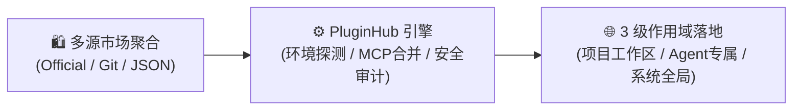

# 🌐 Agent-PluginHub

> **面向 VS Code 底座 IDE 的通用插件与技能管理器，统一赋能多 AI 助手生态（Google Antigravity、OpenCode、OpenAI Codex 等）**  
> Universal Plugin & Skill Manager on VS Code-based IDEs for AI Coding Agents (Google Antigravity, OpenCode, OpenAI Codex & more)  
> 
> [English](./README_EN.md) · [Bug 反馈 / 建议](https://github.com/lamber92/agent-pluginhub/issues) · [贡献插件源](https://github.com/lamber92/agent-pluginhub/pulls)

[](https://code.visualstudio.com/)
[](https://github.com/lamber92/agent-pluginhub/releases)
[](https://www.typescriptlang.org/)
[](https://vuejs.org/)
[](./LICENSE)

| Google Antigravity IDE 运行示意 | VS Code 中搭配 Codex 插件联动 |
| :---: | :---: |
|  |  |

PluginHub 作为扩展运行，**适用于所有以 VS Code 为基础的现代 IDE**（例如 VS Code 本身、Google Antigravity IDE 等）。它旨在解决多 AI 编程助手之间**规范割裂、配置繁琐、MCP 工具链集成复杂**等痛点，提供跨 Agent 生态的一站式可视化管理平台。

> [!NOTE]
> **💡 运行环境与生态依赖说明**
> - **宿主 IDE**：适用于 **VS Code** 官方编辑器、**Google Antigravity IDE** 等基于 VS Code 底座构建的开发环境；
> - **生态扩展依赖**：在 Antigravity IDE 中原生支持 Antigravity 生态；若需使用与管理 **OpenCode** 或 **OpenAI Codex**，需在 VS Code 中安装对应的 Agent 扩展插件。PluginHub 会自动感知并对齐其规范。

---

## 💡 为什么需要 PluginHub？(Why PluginHub?)

随着多款 AI Coding Agent 编程助手的兴起，插件与技能（Skills / MCP）生态日益丰富，但开发者常面临诸多不便：

- ❌ **生态规范割裂**：不同 Agent 的插件目录与配置规范互不兼容；
- ❌ **安装维护繁琐**：依赖手动拷贝文件与修改配置，升级与排错成本高；
- ❌ **MCP 配置复杂**：插件附带的 MCP 工具链需手动配置环境变量与服务；
- ❌ **缺乏作用域隔离**：难以直观划分项目级共享技能与个人全局工具。

**PluginHub** 正是为此而生 —— **面向 VS Code 及多 AI 编程助手的统一可视化插件与技能管理器**，提供智能环境感知、3 级作用域隔离、多源市场聚合及 MCP 自动合并，开箱即用。



---

## ✨ 核心特性

- 🤖 **多 Agent 原生适配**：深度支持 **Google Antigravity**、**OpenCode** 与 **OpenAI Codex**（配合对应 VS Code 插件使用），4 级级联引擎智能感知当前运行环境，随时无缝热切换。
- 🌐 **3 级物理作用域**：支持项目工作区级（随 Git 协同）、Agent 专属级（跨项目个人专属）与系统全局级三层隔离。
- 🛍️ **多源插件市场聚合**：开箱即用官方精选源，并支持添加 GitHub/GitLab 仓库、企业 HTTP JSON 清单及本地离线磁盘源。
- ⚡ **无损启停与安全审计**：不同运行时采用最佳原生启停策略（清单重命名 / `config.toml` 配置驱动），安装前静态审计敏感指令。
- 🔌 **配套 MCP 自动注入**：自动解析插件 `.mcp.json` 所需环境变量，一键合并至目标 Agent 配置文件，告别手动配参。
- 🖥️ **双模交互与全 i18n**：活动栏轻量侧边栏（随手启停）+ 全屏桌面集市（沉浸探索），界面原生支持中英双语即时切换。
- 🔍 **精准版本追踪**：基于语义化版本与 7 位 Git Commit SHA 追踪来源，防误报并支持一键升级。

---

## 🌐 作用域与生态矩阵

| AI 助手生态 (Runtime) | 工作区级 (`WORKSPACE`)<br>`<WorkspaceRoot>/` | Agent 专属级 (`AGENT`)<br>`~/` (用户目录) | 全局级 (`GLOBAL`)<br>`~/.agents/plugins/` |
| :--- | :--- | :--- | :---: |
| **Google Antigravity** | `.agents/plugins/` | `.gemini/config/plugins/` | ❌ *(官方规范未支持)* |
| **OpenCode** | `.opencode/plugins/` | `.config/opencode/plugins/` | ✅ |
| **OpenAI Codex** | `.codex/plugins/` | `.codex/plugins/cache/` | ✅ |

---

## 🚀 快速上手

### 安装方式

#### 方式一：VS Code 扩展市场安装（推荐）
在 VS Code 或兼容编辑器（如 Antigravity / OpenCode）中，打开扩展面板（快捷键 `Ctrl+Shift+X` / `Cmd+Shift+X`），搜索 `Agent-PluginHub` 并点击 **安装 (Install)**。

#### 方式二：VSIX 离线包安装
从 [GitHub Releases](https://github.com/lamber92/agent-pluginhub/releases) 下载最新版本的 `.vsix` 文件，并在终端执行：
```bash
code --install-extension agent-pluginhub-0.1.0.vsix
```
*或在 VS Code 扩展面板右上角 `···` 菜单选择「从 VSIX 安装...」。*

#### 方式三：从源码构建与打包
```bash
# 1. 克隆仓库
git clone https://github.com/lamber92/agent-pluginhub.git
cd agent-pluginhub

# 2. 安装依赖并构建
npm install
npm run build

# 3. 本地打包 VSIX
npm run package
```

### 使用指南

1. **唤起面板**：
   - 点击左侧活动栏的 **PluginHub** 图标（侧边栏紧凑视图，适合高频启停）；
   - 或按快捷键 `Ctrl+Shift+P` / `Cmd+Shift+P` 执行 `PluginHub: 打开全屏插件市场`（完整宽屏桌面视图，适合沉浸探索）。
2. **选择环境与安装**：在「插件市场」挑选所需技能，在弹窗中选择目标 Agent 环境（Antigravity / VSCode With Codex）与安装作用域（工作区级 / AI Agent 级 / 全局系统级），如有 MCP 服务按提示输入环境变量即可一键自动注入。
3. **管理与更新**：在「已安装」管理页中随时一键启停、卸载、更新或导出 ZIP 归档。

> [!TIP]
> **Codex 桌面端同步提示**：在 PluginHub 中对 Codex 插件进行安装或启停后，在 Codex 客户端点击 **`+ New Chat`**（快捷键 `Ctrl+N` / `Cmd+N`）开启新会话，即可立即重载最新配置；亦可通过彻底重启 Codex 应用完成全量刷新。

---

## ⚙️ 常用配置与命令

### 常用命令 (`Ctrl+Shift+P` / `Cmd+Shift+P`)
- `PluginHub: 打开全屏插件市场` (`pluginhub.open`)：唤起全屏插件市场桌面大视窗。
- `PluginHub: 刷新已安装与插件市场` (`pluginhub.refresh`)：清理缓存并重新扫描本地目录与远端市场。

### VS Code 设置项 (`Ctrl+,` 搜索 `pluginhub`)
| 配置项 | 类型 | 默认值 | 说明 |
| :--- | :---: | :---: | :--- |
| `pluginhub.targetAgentRuntime` | `enum` | `"auto"` | 目标运行时：`"auto"`（自动感知）、`"antigravity"`、`"opencode"`、`"codex"` |
| `pluginhub.defaultInstallScope` | `enum` | `"ask"` | 默认安装作用域：`"ask"`（每次询问）、`"workspace"`、`"agent"`、`"global"` |
| `pluginhub.mirrorAcceleration` | `boolean` | `true` | 是否启用国内 CDN 与 GitHub 镜像加速下载 |
| `pluginhub.proxyUrl` | `string` | `""` | HTTP/HTTPS 网络代理地址（适合企业内网环境） |

---

## ❓ 常见问题 (FAQ)

<details>
<summary><b>Q: 插件带有 MCP 工具时，环境变量如何配置？</b></summary>
<br>
检测到待安装插件包含 <code>.mcp.json</code> 时，PluginHub 会在安装弹窗中自动列出该 MCP 服务所声明的环境变量输入项。填入后系统会自动将配置合并写入目标 Agent 的 MCP 配置文件中，无需手动编辑。
</details>

<details>
<summary><b>Q: 为什么 Google Antigravity 下「全局系统级」选项不可用？</b></summary>
<br>
Google Antigravity 官方底层仅识别项目工作区 <code>.agents/</code> 与用户全局目录 <code>~/.gemini/config/</code>，不识别 <code>~/.agents/plugins/</code>。PluginHub 主动屏蔽不可用选项，保障 100% 可用性。
</details>

<details>
<summary><b>Q: 企业内网或离线环境下如何使用？</b></summary>
<br>
1. 在设置中配置 <code>pluginhub.proxyUrl</code> 指向企业代理；<br>
2. 在「市场源管理」中添加企业内部自建 GitLab 仓库或私有 JSON 清单；<br>
3. 支持添加本地磁盘目录作为离线源，实现完全断网安装。
</details>

---

## 🛠️ 本地开发

```bash
# 1. 安装依赖并启动双端监听
npm install && cd webview-ui && npm install && cd ..
npm run watch:ui    # 终端 1：Webview 开发服务器
npm run watch:ext   # 终端 2：VS Code 扩展主进程监听

# 2. 按 F5 启动 Extension Development Host 调试
# 3. 运行测试与类型检查: npm run test && npm run typecheck
```

---

## 📄 开源许可证

本项目基于 [MIT 许可证](./LICENSE) 开源。

Copyright © 2026 **PluginHub Team**
