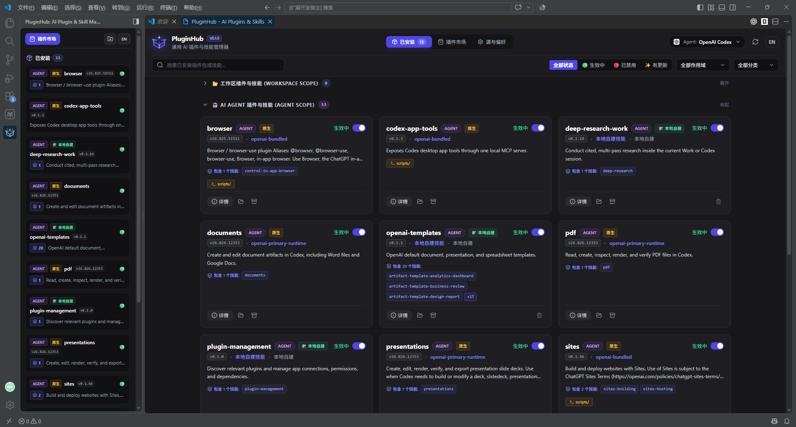
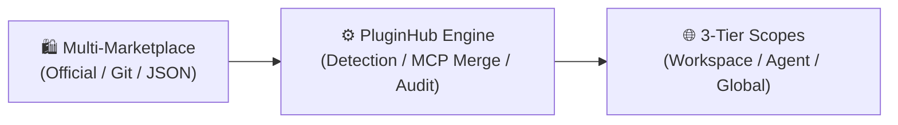

# 🌐 Agent-PluginHub

> **Universal Plugin & Skill Manager on VS Code-based IDEs for AI Coding Agents (Google Antigravity, OpenCode, OpenAI Codex & more)**  
> 
> [中文说明文档 (Chinese)](./README.md) · [Report Bug / Request Feature](https://github.com/lamber92/agent-pluginhub/issues) · [Submit Custom Marketplace](https://github.com/lamber92/agent-pluginhub/pulls)

[](https://code.visualstudio.com/)
[](https://github.com/lamber92/agent-pluginhub/releases)
[](https://www.typescriptlang.org/)
[](https://vuejs.org/)
[](./LICENSE)

| Google Antigravity IDE | VS Code with Codex Extension |
| :---: | :---: |
|  |  |

PluginHub is an extension **crafted for all modern VS Code-based IDEs** (such as standard VS Code, Google Antigravity IDE, etc.). It resolves key pain points across AI assistants — **fragmented directory specifications, tedious manual configurations, and complex MCP toolchain setups** — offering a unified visual management hub for multi-agent ecosystems.

> [!NOTE]
> **💡 Host IDE & Agent Dependencies**
> - **Host IDE**: Runs seamlessly inside **VS Code** or **Google Antigravity IDE** and compatible editor flavors;
> - **Agent Extension Dependencies**: Antigravity is natively supported in Antigravity IDE. To manage and use **OpenCode** or **OpenAI Codex**, please install their companion extensions in VS Code. PluginHub will automatically detect and align with their specifications.

---

## 💡 Why PluginHub?

With the rise of various AI Coding Agents, plugins and skills (Skills / MCP) have flourished, yet developers often face friction:

- ❌ **Fragmented Standards**: Disjointed directory layouts and config formats across different AI agents;
- ❌ **Tedious Maintenance**: Relying on manual file copying and configuration edits with high upgrade and debugging costs;
- ❌ **Complex MCP Setup**: Requiring manual environment variable and server configuration for companion MCP tools;
- ❌ **Lack of Scope Isolation**: Difficult to clearly isolate project-shared skills from personal global tools.

**PluginHub** is built to bridge this gap — providing intelligent runtime detection, 3-tier hybrid scope isolation, multi-marketplace aggregation, and automated MCP setup out of the box.



---

## ✨ Key Features

- 🤖 **Native Multi-Agent Adaptation**: Native alignment with **Google Antigravity**, **OpenCode**, and **OpenAI Codex** (via companion VS Code extensions), featuring a 4-stage cascade engine for auto-detection and on-the-fly switching.
- 🌐 **3-Tier Physical Scopes**: Granular isolation across Workspace scope (committed via Git), Agent Dedicated scope (personal across projects), and Global scope.
- 🛍️ **Multi-Marketplace Aggregation**: Built-in official curated sources, plus full support for custom GitHub/GitLab repositories, corporate HTTP JSON registries, and offline local disk sources.
- ⚡ **Lossless Toggle & Security Auditing**: Native, non-destructive toggling strategies per runtime (manifest renaming / `config.toml` config-driven), alongside pre-installation static security audits for sensitive commands.
- 🔌 **Automated MCP Toolchain Injection**: Automatically parses required environment variables from `.mcp.json` and merges them directly into target agent configurations.
- 🖥️ **Dual-View UX & Native i18n**: Compact sidebar panel for high-frequency toggling + full-screen desktop hub for immersive exploration, with instant English / Chinese localization.
- 🔍 **Precise Version Tracking**: Tracks semantic versions and 7-character Git Commit SHAs to ensure reproducibility and provide one-click seamless upgrades.

---

## 🌐 Scopes & Runtime Matrix

| AI Agent Runtime | Workspace Scope (`WORKSPACE`)<br>`<WorkspaceRoot>/` | Agent Dedicated Scope (`AGENT`)<br>`~/` (User Home) | Global Scope (`GLOBAL`)<br>`~/.agents/plugins/` |
| :--- | :--- | :--- | :---: |
| **Google Antigravity** | `.agents/plugins/` | `.gemini/config/plugins/` | ❌ *(Not supported by Antigravity spec)* |
| **OpenCode** | `.opencode/plugins/` | `.config/opencode/plugins/` | ✅ |
| **OpenAI Codex** | `.codex/plugins/` | `.codex/plugins/cache/` | ✅ |

---

## 🚀 Quick Start

### Installation

#### Method 1: VS Code Marketplace (Recommended)
In VS Code or compatible editors (e.g. Antigravity / OpenCode), open the Extensions view (`Ctrl+Shift+X` / `Cmd+Shift+X`), search for `Agent-PluginHub`, and click **Install**.

#### Method 2: Offline VSIX Package
Download the latest `.vsix` from [GitHub Releases](https://github.com/lamber92/agent-pluginhub/releases) and execute in terminal:
```bash
code --install-extension agent-pluginhub-0.1.0.vsix
```
*Or select "Install from VSIX..." via the `···` menu in the Extensions view.*

#### Method 3: Build from Source
```bash
# 1. Clone repository
git clone https://github.com/lamber92/agent-pluginhub.git
cd agent-pluginhub

# 2. Install dependencies & build
npm install
npm run build

# 3. Package into VSIX
npm run package
```

### Usage Guide

1. **Open PluginHub**:
   - Click the **PluginHub** icon in the Activity Bar (Compact Sidebar View for quick toggles);
   - Or press `Ctrl+Shift+P` / `Cmd+Shift+P` and run `PluginHub: 打开全屏插件市场` (Full-Screen Desktop View for discovery).
2. **Discover & Install**: Browse the Marketplace tab, click "Install", select your target agent environment (**Antigravity / VSCode With Codex**) and install scope (Workspace / Agent / Global), and fill in any required MCP environment variables.
3. **Manage & Update**: Toggle, update, uninstall, or export ZIP archives at any time in the "Installed" tab.

> [!TIP]
> **Codex Desktop Client Sync Tip**: After installing or toggling Codex plugins in PluginHub, click **`+ New Chat`** (`Ctrl+N` / `Cmd+N`) in the Codex / ChatGPT desktop app to immediately reload configuration; or restart the Codex app for a full refresh.

---

## ⚙️ Configuration & Commands

### Commands (`Ctrl+Shift+P` / `Cmd+Shift+P`)
- `PluginHub: 打开全屏插件市场` (`pluginhub.open`): Open the full-screen marketplace hub.
- `PluginHub: 刷新已安装与插件市场` (`pluginhub.refresh`): Clear caches and refresh local scan results and remote sources.

### VS Code Settings (`Ctrl+,` -> search `pluginhub`)
| Setting | Type | Default | Description |
| :--- | :---: | :---: | :--- |
| `pluginhub.targetAgentRuntime` | `enum` | `"auto"` | Target runtime: `"auto"` (Auto-detect), `"antigravity"`, `"opencode"`, `"codex"` |
| `pluginhub.defaultInstallScope` | `enum` | `"ask"` | Default install scope: `"ask"` (Always prompt), `"workspace"`, `"agent"`, `"global"` |
| `pluginhub.mirrorAcceleration` | `boolean` | `true` | Enable CDN and GitHub mirror acceleration for faster asset downloads |
| `pluginhub.proxyUrl` | `string` | `""` | HTTP/HTTPS proxy URL for corporate or restricted network environments |

---

## ❓ FAQ

<details>
<summary><b>Q: How are environment variables configured for plugins with MCP tools?</b></summary>
<br>
When PluginHub detects a <code>.mcp.json</code> inside a plugin, the installation modal automatically renders input fields for declared environment variables (such as <code>API_KEY</code>). Once entered, PluginHub merges them directly into the target agent's MCP configuration without manual editing.
</details>

<details>
<summary><b>Q: Why is "Global Scope" unavailable under Google Antigravity?</b></summary>
<br>
Google Antigravity's official architecture only recognizes the workspace <code>.agents/</code> directory and user configuration directory <code>~/.gemini/config/</code>, ignoring <code>~/.agents/plugins/</code>. PluginHub disables this option when Antigravity is active to prevent unfindable plugins and ensure 100% usability.
</details>

<details>
<summary><b>Q: How can PluginHub be used in offline or enterprise intranet environments?</b></summary>
<br>
1. Configure <code>pluginhub.proxyUrl</code> in settings to route through corporate proxies;<br>
2. Add internal self-hosted GitLab repositories or private JSON registries in "Source Management";<br>
3. Add local disk directories as offline sources for complete air-gapped installations.
</details>

---

## 🛠️ Local Development

```bash
# 1. Install dependencies & start watchers
npm install && cd webview-ui && npm install && cd ..
npm run watch:ui    # Terminal 1: Webview dev server
npm run watch:ext   # Terminal 2: VS Code extension host compiler

# 2. Press F5 to launch Extension Development Host
# 3. Run unit tests and type checks: npm run test && npm run typecheck
```

---

## 📄 License

This project is licensed under the [MIT License](./LICENSE).

Copyright © 2026 **PluginHub Team**
